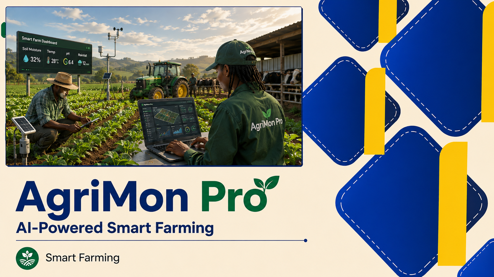
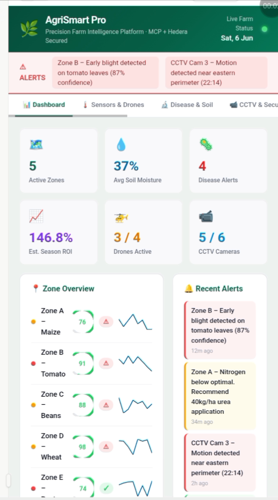

# 🌿 AgriMon Pro 

**Precision Farm Intelligence Platform** — AI-powered crop monitoring, livestock management, CCTV security, and blockchain-secured financial records for smallholder and commercial farmers.



> Built with React · Claude AI · Hedera Hashgraph · MCP · YOLOv8 Computer Vision . GitHub Copilot

---

## Table of Contents

- [Overview](#overview)
- [Features](#features)
- [Tech Stack](#tech-stack)
- [File Structure](#file-structure)
- [Getting Started](#getting-started)
- [Environment Variables](#environment-variables)
- [Module Guide](#module-guide)
- [Hedera Integration](#hedera-integration)
- [MCP Connectors](#mcp-connectors)
- [YOLO & CCTV Security](#yolo--cctv-security)
- [AI Advisor](#ai-advisor)
- [Budget & Finance](#budget--finance)
- [Synthetic Data Mode](#synthetic-data-mode)
- [Deployment](#deployment)
- [Roadmap](#roadmap)
- [Contributing](#contributing)
- [License](#license)

---

## Overview

AgriMon Pro  consolidates drone camera feeds, soil sensors, weather history, livestock data, and farm finances into a single dashboard. It uses Claude AI for agronomic advice, YOLOv8 for real-time intruder and animal detection, and Hedera Hashgraph for tamper-proof transaction and incident records.

All sensor data is currently **synthetically generated** for demonstration purposes, making it easy to run without any physical hardware. Every data source is designed to be swapped for a real API by replacing a single file in `src/data/`.

---

## Features

| Module | Description |
|--------|-------------|
| 📊 Dashboard | Live zone overview, alert bar, 14-day weather strip |
| 🌡️ Sensors & Drones | Soil moisture, pH, NPK, CO₂, drone telemetry per zone |
| 🔬 Disease & Soil | AI vision disease detection, soil type analysis, crop recommendations |
| 📹 CCTV & Security | YOLOv8 object detection, person/intruder alerts, Hedera incident log |
| 🐄 Livestock | Per-species feed formulations, daily costs, farm structure status |
| 💰 Budget & Finance | Input vs revenue breakdown, ROI, profit/loss summary |
| 🔗 Blockchain | Hedera TX ledger, HBAR balance, MCP integration status |
| 🤖 AI Advisor | Claude-powered chat with live sensor and budget context |
| 📚 Best Practices | Evidence-based agronomy tips, seasonal planting calendar |

---



## Tech Stack

- **Frontend** — React 18, TypeScript, Vite, Tailwind CSS
- **AI** — Anthropic Claude (`claude-sonnet-4-20250514`) via REST API
- **Blockchain** — Hedera Hashgraph SDK (`@hashgraph/sdk`) — transactions, HCS topics, NFT minting
- **MCP** — Model Context Protocol — drone, soil, weather, market price, and finance connectors
- **Computer Vision** — YOLOv8 ONNX (via `onnxruntime-web` Web Worker) for CCTV detection
- **State** — Zustand
- **Charts** — Custom SVG (Gauge, Sparkline, BarChart components)

---

## File Structure

```
agrismart-pro/
├── public/
│   ├── yolov8n.onnx              # YOLOv8 nano model (farm-tuned)
│   └── favicon.svg
│
├── src/
│   ├── main.tsx                  # App entry point
│   ├── App.tsx                   # Router, global state, tab shell
│   ├── index.css                 # Tailwind base + design tokens
│   │
│   ├── data/                     # Synthetic data engine (swap for real APIs)
│   │   ├── synthetic.ts          # rand(), generateSensorData(), generateWeatherHistory()
│   │   ├── constants.ts          # ZONES, DISEASES, SOIL_TYPES, ANIMALS, FEED_RECS
│   │   ├── budget.ts             # generateBudget(), generateTransactions()
│   │   └── cctv.ts               # CCTV_FEEDS, generateAlerts(), incident log seed
│   │
│   ├── pages/                    # One file per dashboard tab
│   │   ├── Dashboard.tsx
│   │   ├── Sensors.tsx
│   │   ├── Disease.tsx
│   │   ├── Security.tsx          # YOLO
│   │   ├── Livestock.tsx
│   │   ├── Budget.tsx
│   │   ├── Blockchain.tsx        # Hedera
│   │   ├── AIAdvisor.tsx         # Claude
│   │   └── Practices.tsx
│   │
│   ├── components/               # Reusable UI atoms
│   │   ├── Gauge.tsx             # SVG arc gauge
│   │   ├── Sparkline.tsx         # Mini trend chart
│   │   ├── BarChart.tsx          # SVG bar chart
│   │   ├── CCTVCard.tsx          # Canvas feed + YOLO bounding boxes
│   │   ├── AlertBar.tsx          # High-severity sticky alert strip
│   │   ├── Badge.tsx             # Severity / status pill
│   │   ├── MetricCard.tsx        # Icon + value + label tile
│   │   ├── NavBar.tsx            # Tab strip, live indicator, header
│   │   └── ZoneSelector.tsx      # Zone pill buttons (A–E)
│   │
│   ├── lib/
│   │   ├── hedera/               # Hedera Hashgraph layer
│   │   │   ├── client.ts         # HederaClient init, testnet/mainnet config
│   │   │   ├── transactions.ts   # submitCropSale(), submitInputPurchase()
│   │   │   ├── topics.ts         # HCS sensor data stream topic
│   │   │   ├── nft.ts            # Crop yield NFT minting
│   │   │   └── audit.ts          # Immutable security incident log
│   │   │
│   │   ├── mcp/                  # Model Context Protocol connectors
│   │   │   ├── mcpClient.ts      # Client bootstrap, tool registry, sessions
│   │   │   ├── droneOracle.ts    # Drone telemetry → Hedera topic
│   │   │   ├── soilSensorMCP.ts  # NPK/moisture → immutable records
│   │   │   ├── weatherMCP.ts     # KMet/OpenWeather → farm advisories
│   │   │   ├── marketPriceMCP.ts # NARIG commodity prices (pending)
│   │   │   └── financeMCP.ts     # Input purchase + sales tokenisation
│   │   │
│   │   ├── ai/                   # Claude / Anthropic layer
│   │   │   ├── claudeClient.ts   # Anthropic API wrapper, streaming
│   │   │   ├── systemPrompt.ts   # Live sensor + budget context injector
│   │   │   └── diseaseClassifier.ts  # Vision API for drone image analysis
│   │   │
│   │   └── vision/               # YOLO / Computer Vision layer
│   │       ├── yoloWorker.ts     # Web Worker — YOLOv8 ONNX inference
│   │       ├── drawBoundingBox.ts # Canvas overlay renderer
│   │       ├── classes.ts        # Detection classes: person, animal, vehicle
│   │       └── simulatedFeed.ts  # Canvas synthetic frame generator (demo)
│   │
│   ├── store/                    # Zustand state management
│   │   ├── farmStore.ts          # Sensors, alerts, selected zone, tick
│   │   ├── budgetStore.ts        # Inputs, revenue, ROI selectors
│   │   └── chatStore.ts          # AI chat history, loading, quick prompts
│   │
│   ├── hooks/
│   │   ├── useLiveSensors.ts     # setInterval synthetic refresh (5s)
│   │   ├── useHederaTx.ts        # submitTx, watchConfirmation, receipt polling
│   │   └── useCCTVTick.ts        # 1-second canvas refresh for all feeds
│   │
│   └── types/
│       ├── farm.d.ts             # SensorReading, ZoneData, AlertItem, WeatherDay
│       ├── hedera.d.ts           # Transaction, TopicMessage, NFTMetadata
│       └── vision.d.ts           # Detection, BoundingBox, CCTVFeed
│
├── .env                          # Secret keys (never commit)
├── package.json
├── vite.config.ts
└── tsconfig.json
```

---

## Getting Started

### Prerequisites

- Node.js 18+
- npm 9+ or yarn
- A free [Hedera Testnet account](https://portal.hedera.com/) (for blockchain features)
- An [Anthropic API key](https://console.anthropic.com/) (for AI Advisor)

### Installation

```bash
git clone https://github.com/your-org/agrismart-pro.git
cd agrismart-pro
npm install
```

### Run in development

```bash
npm run dev
```

Open `http://localhost:5173` in your browser. The app runs fully on synthetic data with no external services required.

### Build for production

```bash
npm run build
npm run preview
```

---

## Environment Variables

Create a `.env` file in the project root:

```env
# Anthropic (AI Advisor)
VITE_ANTHROPIC_API_KEY=sk-ant-...

# Hedera Hashgraph
VITE_HEDERA_NETWORK=testnet
VITE_HEDERA_ACCOUNT_ID=0.0.XXXXXX
VITE_HEDERA_PRIVATE_KEY=302e...

# MCP (optional — platform works without these in demo mode)
VITE_WEATHER_API_KEY=...
VITE_MARKET_PRICE_API_KEY=...
```

> ⚠️ Never commit `.env` to version control. All `VITE_` prefixed variables are exposed to the browser — do not put server-side secrets here in production. Use a backend proxy for production deployments.

---

## Module Guide

### Dashboard

The entry tab shows a six-metric summary row (active zones, soil moisture, disease alerts, ROI, drones, CCTV cameras), a zone health list with sparklines and drone health gauges, a recent alerts panel, and a 10-day weather strip.

Clicking any zone row in the dashboard navigates directly to the Sensors tab with that zone pre-selected.

### Sensors & Drones

Select a zone with the pill buttons at the top. Each zone shows:

- **Soil sensors** — moisture, temperature, pH, CO₂ as arc gauges
- **Nutrient levels** — N, P, K as progress bars with mg/kg readings
- **Drone telemetry** — health score, estimated yield (t/ha), air temperature, light (lux)
- **Live moisture trend** — sparkline refreshing every 5 seconds
- **Crop health index** — bar chart comparing estimated yield across all zones

### Disease & Soil

Displays disease detection results from the drone vision pipeline per zone (or "None Detected"). Each card shows disease name, nutrient status, soil type, and pH. Diseased zones show a recommended action.

The soil analysis table gives a full view across all zones: soil type, pH, NPK readings, and best-suited crop varieties by soil type.

### CCTV & Security

Six canvas-rendered camera feeds simulate live YOLO inference. Detections are drawn as coloured bounding boxes with class labels and confidence scores:

- 🟥 Red box — person / intruder detected
- 🟡 Yellow box — cattle or livestock
- 🟢 Green box — authorised worker

All incidents are written to the Hedera audit log with a transaction ID. Offline cameras show a grey `OFFLINE` state.

### Livestock

Per-species cards for seven animal types. Each shows head count, recommended feed formulation, daily feed quantity per head, and total daily cost in KSh.

Farm structures section covers the dairy barn, poultry house, grain store, feed store, irrigation pump, and perimeter fence — each with a status badge and CCTV camera count.

### Budget & Finance

Three summary cards show total input cost, total revenue, and net profit with ROI percentage. Below are itemised input and revenue tables with proportion bars, followed by a combined bar chart of all line items.

All values are in Kenyan Shillings (KSh).

### Blockchain (Hedera)

Displays the connected Hedera account, HBAR balance, and all farm transactions with confirmation status. The MCP integration panel shows the status of each connector (active / pending).

### AI Advisor

A chat interface powered by Claude. Every message automatically includes the current sensor readings, weather, and budget as system context so Claude can give farm-specific advice.

Quick-prompt buttons above the input cover the most common queries. Press Enter or click Ask to submit.

### Best Practices

Eight evidence-based agronomy tips covering soil health, water management, pest management, fertiliser use, harvest timing, record keeping, climate adaptation, and post-harvest storage.

A 12-month planting calendar shows optimal sowing and growing windows for maize, beans, tomatoes, and wheat for East African conditions.

---

## Hedera Integration

AgriMon Pro  uses Hedera Hashgraph for three purposes:

**1. Financial transactions** (`lib/hedera/transactions.ts`)

Every crop sale and input purchase is submitted as a Hedera transaction. The transaction ID (e.g. `0.0.487293`) is stored alongside the record as a tamper-proof receipt.

**2. Sensor data streaming** (`lib/hedera/topics.ts`)

The Hedera Consensus Service (HCS) is used as a public append-only log for drone and soil sensor readings. Each zone's readings are published to a dedicated topic at configurable intervals.

**3. Security incident audit** (`lib/hedera/audit.ts`)

Every CCTV detection event above a confidence threshold is written to Hedera as an immutable record. This provides a chain-of-custody log for security incidents that cannot be altered after the fact.

**4. Certified produce NFTs** (`lib/hedera/nft.ts`)

High-yield batches can be minted as NFTs with embedded soil and weather provenance data, enabling premium pricing in certified supply chains.

---

## MCP Connectors

The Model Context Protocol layer (`lib/mcp/`) bridges external data sources into the platform's tool registry. Each connector exposes a standard interface so Claude and other consumers can call it uniformly.

| Connector | Status | Description |
|-----------|--------|-------------|
| `droneOracle` | Active | Publishes drone telemetry to Hedera HCS topic |
| `soilSensorMCP` | Active | Writes NPK and moisture readings to immutable records |
| `weatherMCP` | Active | Fetches KMet / OpenWeather data, produces farm advisories |
| `financeMCP` | Active | Tokenises input purchases and crop sales on Hedera |
| `marketPriceMCP` | Pending | NARIG commodity price feed (connector in development) |

To add a new MCP connector, create a file in `lib/mcp/`, implement the standard `MCPConnector` interface, and register it in `mcpClient.ts`.

---

## YOLO & CCTV Security

In demo mode, `lib/vision/simulatedFeed.ts` generates synthetic canvas frames with randomised detections. In production, replace this with a real RTSP or WebSocket video stream and route frames to `yoloWorker.ts`.

The YOLOv8 model (`public/yolov8n.onnx`) runs inside a Web Worker via `onnxruntime-web` to avoid blocking the main thread. Detections are passed back to the main thread and drawn by `drawBoundingBox.ts` on each camera's `<canvas>` element.

**Detection classes used:**

| Class | Colour | Action |
|-------|--------|--------|
| `person` (unknown) | Red | Alert → Hedera log → notify farm manager |
| `person` (worker) | Green | Log only — normal activity |
| `cow` / `goat` / `sheep` | Yellow | Log — normal livestock movement |
| `vehicle` | Blue | Log plate, verify against access list |

To fine-tune the model for your specific farm environment, retrain YOLOv8 on labelled footage from your own cameras and replace `yolov8n.onnx` in `public/`.

---

## AI Advisor

The AI Advisor sends each user message to Claude along with a system prompt that includes:

- All zone sensor readings (pH, moisture, N/P/K, disease status)
- Current weather and 3-day forecast
- Budget summary (total inputs, revenue, profit, ROI)

This means Claude's answers are always grounded in the actual state of your farm, not generic advice.

The system prompt is built in `lib/ai/systemPrompt.ts`. Edit this file to add additional context (e.g. historical yield records, farm location, crop calendar) for more precise recommendations.

---

## Budget & Finance

The budget module tracks:

- **Input costs** — seeds, fertilisers, pesticides, irrigation, labour, machinery, animal feed, veterinary
- **Revenue streams** — maize, tomato, bean sales, milk, eggs, livestock sales

All values are in KSh. ROI is calculated as `(revenue − costs) / costs × 100`.

In production, connect `lib/hedera/transactions.ts` to automatically pull confirmed Hedera transactions into the budget rather than using synthetic figures.

---

## Synthetic Data Mode

All sensor, weather, alert, CCTV, and budget data is generated by the functions in `src/data/`. The live sensor data refreshes every 5 seconds via `useLiveSensors.ts`.

To connect a real data source, replace the corresponding function in `src/data/` with an API call. The rest of the application will pick up the new data automatically because all pages read from the Zustand store, not directly from the data files.

Example — replacing synthetic soil sensors with a real IoT API:

```typescript
// src/data/synthetic.ts — before
export const generateSensorData = () =>
  ZONES.map((zone, i) => ({ zone, soil_moisture: rand(20, 80), ... }));

// After — fetch from your sensor API
export const generateSensorData = async () => {
  const res = await fetch('https://your-iot-api.com/sensors');
  return res.json();
};
```

---

## Deployment

### Vercel (recommended)

```bash
npm install -g vercel
vercel --prod
```

Set all environment variables in the Vercel dashboard under Project → Settings → Environment Variables.

### Docker

```dockerfile
FROM node:18-alpine AS build
WORKDIR /app
COPY package*.json ./
RUN npm ci
COPY . .
RUN npm run build

FROM nginx:alpine
COPY --from=build /app/dist /usr/share/nginx/html
EXPOSE 80
```

```bash
docker build -t agrismart-pro .
docker run -p 80:80 agrismart-pro
```

> For production, never expose the Anthropic API key client-side. Add a thin backend proxy (Express or Next.js API route) that forwards requests to Anthropic and authenticates farm users before relaying.

---

## Roadmap

- [ ] Real IoT sensor integration (MQTT / LoRaWAN)
- [ ] Live RTSP CCTV feed ingestion
- [ ] Hedera mainnet production deployment
- [ ] `marketPriceMCP` — NARIG / KAMIS commodity price feed
- [ ] Mobile app (React Native)
- [ ] Offline-first PWA mode for low-connectivity farms
- [ ] Multi-farm / cooperative support
- [ ] Agronomist report export (PDF)
- [ ] SMS alert integration (Africa's Talking API)
- [ ] Weather-based irrigation scheduling automation

---

## Contributing

1. Fork the repository
2. Create a feature branch: `git checkout -b feature/your-feature`
3. Commit your changes: `git commit -m "feat: add your feature"`
4. Push to the branch: `git push origin feature/your-feature`
5. Open a pull request

Please follow the [Conventional Commits](https://www.conventionalcommits.org/) format for commit messages.

---

## License

MIT License — see [LICENSE](./LICENSE) for details.

---

*AgriMon Pro  · MCP Integrated · Hedera Hashgraph Secured · YOLOv8 Computer Vision · Claude AI Advisor*
